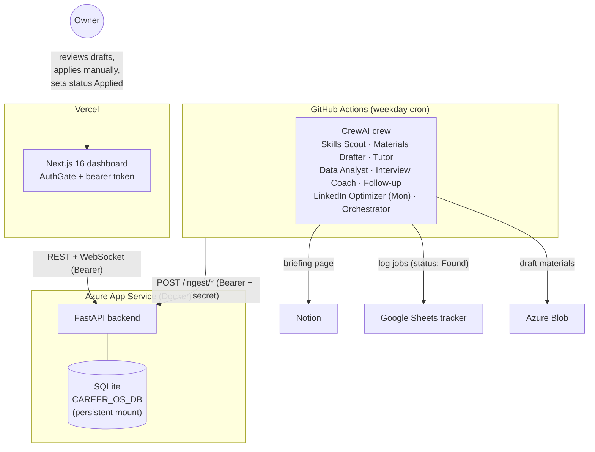

# Career OS — Architecture

## System overview

Career OS has three moving parts:

1. **Agent crew** (`backend/main.py` + `backend/agents/` + `backend/tools/`) — a CrewAI pipeline that runs in GitHub Actions every weekday morning. It searches the job market, drafts application materials, writes a lesson, and compiles a briefing. It talks to Notion, Google Sheets, and Azure Blob directly, and reports results to the API.
2. **API backend** (`backend/api/`) — FastAPI + SQLite, deployed as a Docker container on Azure App Service. Stores runs, briefings, metrics, the application pipeline, and interview sessions. Every private route requires a bearer token.
3. **Dashboard** (`frontend/`) — Next.js 16 on Vercel. Password-gated pages for the daily briefing, pipeline Kanban, interview practice, and a live agent monitor.



## Backend routes

| Prefix | Purpose | Auth |
|--------|---------|------|
| `GET /health` | liveness probe | public |
| `POST /auth/login`, `POST /auth/verify` | password → session token | public (password-checked) |
| `/briefings` | today's + historical briefings | bearer |
| `/pipeline` | application Kanban; `PATCH /{id}/status` is the manual status path | bearer |
| `/interview` | AI practice sessions + history | bearer |
| `/runs` | trigger (gated by `ALLOW_MANUAL_RUNS`), status, latest | bearer |
| `/analytics` | metrics + summary | bearer |
| `/activity` | recent activity feed | bearer |
| `/ingest` | crew-result, applications sync, run-failure — called by the workflow | bearer + `INGEST_SECRET` |
| `/email` | render + send the briefing email | bearer + `INGEST_SECRET` |
| `/tts` | ElevenLabs proxy | bearer |
| `/demo` | seed sanitized sample data | bearer; **not registered in production** |
| `WS /ws/agents` | live agent log stream | token query param |

## Frontend app structure

```
frontend/app/
├── page.tsx           # public landing (project description, no private data)
├── dashboard/         # AuthGate — briefing, stats, activity
├── pipeline/          # AuthGate — Kanban (Found → … → Offer)
├── interview/         # AuthGate — AI practice with voice
├── agents/            # AuthGate — live run monitor (WebSocket)
├── resume/            # AuthGate — resume/portfolio page
└── projects/          # public portfolio case studies
```

`lib/api.ts` attaches `Authorization: Bearer <token>` (from the login session) to every call and appends the token to WebSocket URLs.

## Agent workflow & truthfulness rules

Tasks chain sequentially: scan → project concept → lesson → draft materials → interview prep → follow-up check → (Mon: LinkedIn audit) → compile briefing.

Hard rules enforced in code, not just prompts:

- Agents log opportunities with status **Found** only; the Sheets tool coerces anything else.
- `/ingest/applications` coerces any non-automation status to `Found` and never overwrites a manually-set status (`Applied` and beyond).
- Only `PATCH /pipeline/{id}/status` — a manual dashboard action — can set `Applied`.
- Postings without a canonical URL are logged `validation_status=unverified`; duplicates are detected on company + role + URL.

## Data flow

1. Cron fires (weekdays, several windows; a guard skips if today's briefing exists).
2. Crew runs in the Actions runner; resume/profile text is written from repo secrets at run time.
3. Results: Notion page, Sheets rows (Found), Azure Blob materials.
4. Workflow POSTs the cleaned briefing to `/ingest/crew-result`, syncs Sheet rows to `/ingest/applications`, triggers `/email/briefing`.
5. On failure, the workflow POSTs `/ingest/run-failure` so the dashboard shows the failed run with an error message.
6. The owner reads the briefing, reviews drafts, applies manually, and moves cards on the Kanban.

## Auth model

- `CAREER_OS_API_TOKEN` (static, env) — used by workflows; accepted on all private routes.
- Session tokens — issued by `/auth/login` after an `hmac.compare_digest` password check; stored in process memory (reset on redeploy → the dashboard re-prompts).
- Ingest/email additionally require `INGEST_SECRET` in the body (defense in depth).

## Persistence model

- SQLite via `CAREER_OS_DB`. Local default: `backend/career_os.db`. Production: `/home/career-os/career_os.db` on the App Service persistent mount (`WEBSITES_ENABLE_APP_SERVICE_STORAGE=true`).
- Schema init is idempotent: `CREATE TABLE IF NOT EXISTS` plus additive `ALTER TABLE` column migrations on startup. Nothing destructive runs at boot.
- `PUBLIC_DEMO_MODE=true` swaps the path to a separate demo database so real data is never served by a demo instance.

## Deployment model

- Backend image: `Build Backend Image` workflow → GHCR (`career-os-api:latest`) → Azure App Service pulls on restart.
- Frontend: Vercel (`frontend/` root, `NEXT_PUBLIC_API_URL` env).
- CI (`ci.yml`): backend pytest, frontend typecheck + lint + build, Docker build — no real secrets.

## Known limitations

- Single-user by design: one password, one API token, no user accounts.
- SQLite: fine for one user; move to Postgres/Azure SQL before any multi-user use.
- Session tokens are in-memory: a backend redeploy logs the dashboard out.
- Job "verification" is URL-presence + agent-side rules — it does not re-fetch each posting to confirm it is still live.
- No monitoring/alerting stack beyond dashboard run records and Actions logs.

## Future improvements

- Postgres option + Alembic migrations
- Live posting re-validation before logging (`expired` status)
- Stage-level progress in the runs table surfaced in the monitor page
- Browser helper to mark a job Applied at the moment of manual submission
